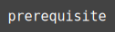
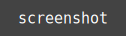

<h1 align="center">prerequisite</h1>

  <a href="">&#9634; demo</a>
  &#9635; prerequisite
  <a href="">&#9634; bottom</a>
  <a href="">&#9634; top</a>
  <a href="">&#9634; license</a>

 
 
 

<h1 align="center">prerequisite</h1>

  &#9898; <a href="">demo</a>
  &#9899; prerequisite
  &#9898; <a href="">bottom</a>
  &#9898; <a href="">top</a>
  &#9898; <a href="">license</a>

 
 
 

    
    
    

 
 
 

  
   
  
  

  
  
 

  
  
  
  
    
  

 
 
 

  
  
  
  

 
 
 

 

  
  
  
  
  

 
 
 

 

      
  A simple web-app that with the help of:    
    
    
    
    
    
    
      
  will try to help you, so you 
  can have a better experience 
  when you want to use a console-like 
  app to deal with MySql or other databases. 
  
  If it exists, use it;  
  if it does not exist, create it;  
  if you can not create it, imagine it.  

 

 

